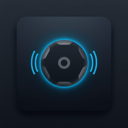

# mach

<p align="center">
  
</p>

<p align="center">
  <a href="https://github.com/fauzanazz/mach/blob/main/LICENSE"></a>
  <a href="https://github.com/fauzanazz/mach"></a>
</p>

**Mechanical keyboard sounds for your Mac.** mach is a lightweight macOS menu bar app that plays realistic typing sounds globally while you type.

Built with Swift and designed to be configurable, mach supports KeyZen-style per-key sound routing with both keydown and keyup sounds for an authentic mechanical keyboard experience.

## Features

- **Native macOS Experience** - Clean menu bar app with no Dock icon (`LSUIElement`)
- **Global Key Capture** - Works across all apps via `CGEventTap`
- **Per-Key Sound Routing** - Scancode-based mapping for down/up sounds
- **Sound Pack System** - Configurable packs with sprite slicing or individual samples
- **Adjustable Volume** - Control sound level from the menu bar
- **Launch at Login** - Optional auto-start on macOS boot

## Installation

**Requirements:** macOS 13+ (Ventura or later)

### Homebrew (Recommended)

```bash
brew tap fauzanazz/mach
brew install --cask mach
```

### Download Pre-built Release

> **Tip**: For easier installation without Gatekeeper warnings, use [Homebrew](#homebrew-recommended) instead.

1. Go to the [**Releases**](https://github.com/fauzanazz/mach/releases) page
2. Download `mach.zip`
3. Extract and drag `mach.app` to `/Applications`
4. **First Launch**: Right-click the app → **Open** → click **Open** on the warning dialog
5. Grant Input Monitoring permission when prompted

### Build from Source

```bash
git clone https://github.com/fauzanazz/mach.git
cd mach
scripts/build-app.sh
open mach.app
```

## Permissions

mach requires **Input Monitoring** permission to capture global key events.

If key sounds do not play:

1. Open **System Settings → Privacy & Security → Input Monitoring**
2. Enable `mach` (or remove and re-add it)
3. Quit and relaunch the app

## Troubleshooting

| Issue | Solution |
|-------|----------|
| `CGEvent.tapCreate FAILED` | Re-grant Input Monitoring permission, then relaunch |
| App runs but no sound | Check enabled state and volume in menu bar; verify pack has valid assets |
| Debug logs | `tail -f ~/mach-debug.log` |

## Documentation

- [Development Guide](docs/development.md) - Architecture, sound pack format, scripts
- [Release Guide](docs/release.md) - Build, sign, notarize workflows
- [Homebrew Tap Setup](docs/homebrew-tap.md) - Distribute via Homebrew
- [Branch Protection](docs/branch-protection.md) - CI/CD configuration

## Inspiration

The per-key sound routing approach is inspired by [shivabhattacharjee/KeyZen](https://github.com/shivabhattacharjee/KeyZen).

## License

MIT License - see [LICENSE](LICENSE) file for details.
